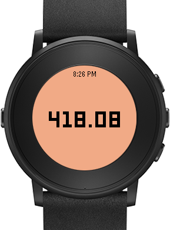

# BitcoinPrice

This is an app for [Pebble](https://www.pebble.com/) watches running on the basalt (Pebble Time) and chalk (Pebble Time Round) platforms. This app uses the [BitcoinAverage Price Index](https://bitcoinaverage.com/) API to receive data.

## FAQ

**1. Why doesn't this support the aplite (Pebble/Pebble Steel) platform?**

Currently the app is using some non-aplite specific code. It could probably be wrapped in an `#ifdef`, and I'll get there at some point to try that theory out.

**2. Why can't I pick a different currency than USD?**

That's coming soon.
